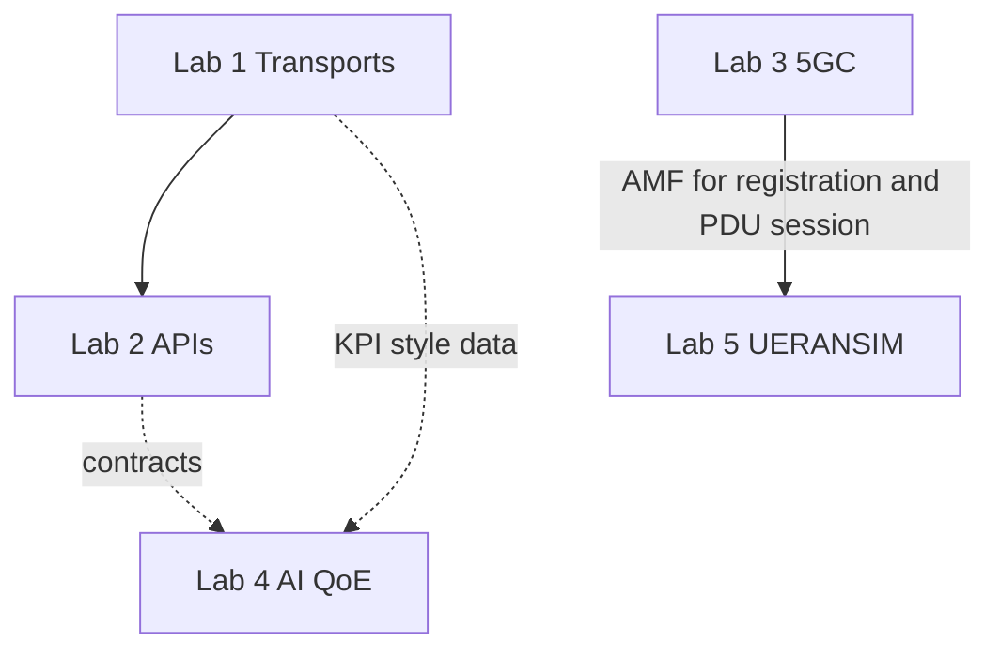

# Architecture — one connected 5G lab system

This repository is **one vertical slice**, not five separate homework pieces. Think **bottom = bits on the wire**, **middle = 5G core**, **top = intelligence**.

---

## 30-second version (say this)

“We stack **transports** and **APIs** on top, run a real **5G core** in the middle, attach **UERANSIM** for **gNB and UE** signaling, and add an **AI QoE graph** that reads KPIs and outputs operator advice. **`run_demo.sh`** runs the stack in order; **`logs/`** is our proof.”

---

## Layer table (exam order: 1 → 2 → 3 → 5 → 4)

| Order | Lab | Layer | What it proves |
| ---: | --- | --- | --- |
| 1 | **Lab 1** | **Transport** | Dockerized **REST**, **MQTT**, **gRPC** — how services and probes talk. |
| 2 | **Lab 2** | **API / contract** | **Spring Boot** + **Swagger / OpenAPI** — stable HTTP contracts for automation. |
| 3 | **Lab 3** | **5G core** | **Open5GS** (systemd) and **Free5GC** (Docker) — **AMF**, **NRF**, session/control plane footprint. |
| 4 | **Lab 5** | **RAN / UE simulation** | **Ella Core** + **UERANSIM** — **gNB**, **UE**, **registration**, **PDU session**, logs. |
| 5 | **Lab 4** | **Intelligence** | **LangGraph** + **Ollama** — **KPI → QoE → advice** (assurance on top of the network story). |

Lab 4 is **last in the table** because it is an **overlay** on KPIs (you can explain it after the network path is clear). **`run_demo.sh`** still runs Lab 4 **before** Lab 5 so heavy Docker cores finish before the Ella stack; adjust your speech to “intelligence wraps the whole story.”

---

## Core ↔ RAN: UERANSIM and Lab 3 (required statement)

**UE registration** and **PDU session establishment** are the procedures that connect a **UE** to a **5G core** through the **AMF**. **UERANSIM (Lab 5)** is the tool that drives those procedures from a **simulated gNB/UE**.

- **Lab 3** deploys **Open5GS** and/or **Free5GC**, i.e. a real **5G core** with an **AMF** (and **NRF** for NF discovery in these stacks).
- In a **fully integrated** campus setup, you point **UERANSIM** at the **AMF socket exposed by Lab 3** so **registration** and **session** complete **against the same core you started in Lab 3** — that is the strict **L3 → L5** vertical line for viva.
- This repo also ships a **pinned Docker path (Lab 5)** where **UERANSIM** talks to **Ella Core’s AMF** so every student gets **reproducible SCTP/N2** without hand-tuning host routes. The **signaling names** (registration, PDU session, NG setup) are the **same 3GPP concepts** you evidence in **Lab 3’s AMF logs** when traffic hits that core.

**AI layer:** **Lab 4** sits **above** the transport and core story: it consumes **KPI-style inputs** (RSSI, latency, loss) like those you might publish over the patterns in **Lab 1**, and outputs **QoE + advice** for NOC-style explanation — it does not replace the core, it **interprets** service health.

---

## Mermaid — one pipeline



---

## ASCII — same picture

```
        Lab 4  (KPI -> QoE -> advice)  << intelligence
              ^
              |
   Lab 2  APIs / OpenAPI
              ^
              |
   Lab 1  REST + MQTT + gRPC   << transport / integration
              |
============== 5G boundary =================================
              |
   Lab 3  Open5GS + Free5GC    << AMF / NRF / session core
              ^
              |   UE registration + PDU session (3GPP)
              |
   Lab 5  UERANSIM gNB + UE    << RAN/UE simulation
```

---

## Lab 4 graph (three agents)

1. **KPI validation** — thresholds + short LLM summary.  
2. **QoE classification** — LLM returns a **QoE label** (JSON).  
3. **Advice** — LLM returns **action bullets** for RF/transport/core checks.

**Ollama** model default: **`llama3.1:8b`** (local).

---

## Isolation (why demos do not fight each other)

- **Lab 1:** Docker bridge; ports **8080**, **1883**, **50051**.  
- **Lab 2:** Host JVM; port **8081**.  
- **Lab 3:** Open5GS on **systemd**; Free5GC in its **own compose network**.  
- **Lab 5:** **Privileged** Docker; internal **`n3`** subnet for SCTP — do not change ports without updating RAN configs.

---

## Security (lab defaults)

Mosquitto is **anonymous** only inside **Lab 1’s** compose network. Ella uses a **self-signed** HTTPS cert. Tutorial **subscriber keys** are **public** by design.
