# Lab 1–5 Questioner — Easy Q & A (with diagrams)

> Source: **`lab 1  to 5 Questioner.pdf`**  
> Note: The PDF also lists **Lab 6–8**; those are included at the end so nothing is missing.  
> Style: **very simple** language + **Q / A** format.

---

# Lab 1: Docker & transport (REST, CoAP, gRPC, MQTT)

### Q1. What is Docker and why is it used?

**A:** **Docker** packs an app and everything it needs (libraries, settings) into a **box** called a **container**.  
**Why:** Same app runs the same way on **any** PC/lab machine; easy to install, share, and start/stop.

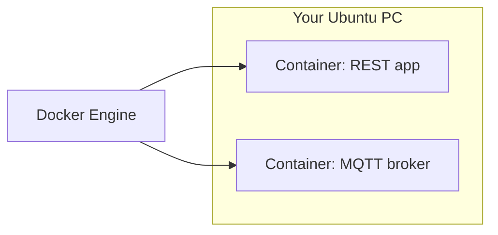

---

### Q2. What is the difference between Docker **image** and **container**?

**A:**

| | **Image** | **Container** |
|--|------------|----------------|
| Think of it as | **Recipe + frozen meal packet** | **Running meal** (actually heating/eating) |
| On disk | Read-only template | Writable running instance |
| Command idea | `docker build` creates image | `docker run` starts container from image |

---

### Q3. What is a REST API?

**A:** **REST** = apps talk over **HTTP** using simple ideas: **URLs** (resources), **methods** (GET, POST…), often **JSON** text.  
Example: `GET /users/5` → “give me user 5’s data.”

---

### Q4. Difference between **GET** and **POST**?

**A:**

| **GET** | **POST** |
|---------|----------|
| **Read** data from server | **Send/create** data to server |
| Often shown in URL / bookmarkable | Body carries data (forms, JSON) |
| Should not change server state (ideal) | Used when you **add or change** something |

---

### Q5. Why is REST **not ideal** for real-time 5G applications?

**A:** REST is mostly **request–response** (you ask, then you wait). **Real-time** needs **always-on** streams, very small delay, and **push** style updates. For that, people use **MQTT**, **gRPC streams**, **WebSockets**, etc.

---

### Q6. What is **MQTT** protocol?

**A:** **MQTT** = lightweight **publish / subscribe** messaging.  
- **Publisher** sends messages to a **topic** (like a channel name).  
- **Subscriber** listens to that **topic** and receives messages.  
- Needs a **broker** in the middle (middleman).

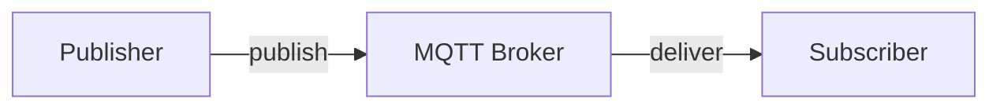

---

### Q7. Where would you use MQTT in **IoT + 5G smart cities**?

**A:** For **sensors** (air quality, parking, traffic, smart lights): many small devices **publish** readings; the city dashboard **subscribes**. **5G** carries the packets; **MQTT** keeps messages **small** and **efficient**.

---

### Q8. What is the **CoAP** protocol?

**A:** **CoAP** = **Constrained Application Protocol**. Like a **tiny cousin of HTTP** for **low-power** devices (small memory, small battery). Uses **UDP** often, very short messages.

---

### Q9. Why is CoAP preferred in **sensor networks** over REST?

**A:** Sensors are **weak** (battery, CPU). CoAP is **lighter** than big HTTP/REST. Less bytes, less energy — better for **many small sensors**.

---

### Q10. What is **gRPC**?

**A:** **gRPC** = Google’s way for programs to call each other’s **functions** over the network (like “remote procedure call”). Uses **HTTP/2** and **Protocol Buffers** (compact binary messages).

---

### Q11. Difference between **gRPC** and **REST**?

**A:**

| | **REST** | **gRPC** |
|--|----------|----------|
| Data style | Often **JSON** (text, bigger) | **Binary** (usually smaller, faster) |
| Style | Resource URLs + HTTP verbs | **RPC**: “call this function” |
| Best for | Web, humans, simple APIs | **Internal** microservices, low latency |

---

### Q12. Why is gRPC suitable for **low-latency 5G** services?

**A:** Smaller messages + fast **HTTP/2** + optional **streaming** → less delay. Good when **core network** or **edge** services must talk **very quickly**.

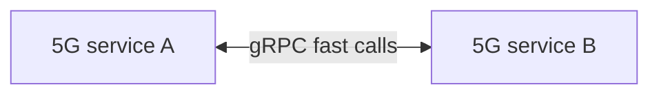

---

# Lab 2: free5GC implementation

### Q1. What is **free5GC**?

**A:** **free5GC** is **open-source software** that acts like a **mini 5G Core (5GC)** on your computer. Used to **learn**, **test**, and **research** how a real 5G core behaves.

---

### Q2. What are the main components of the **5G Core (5GC)**?

**A:** Think “**many helper apps**” instead of one big box. Common names you should know:

| NF | Simple meaning |
|----|----------------|
| **AMF** | Admits phone, mobility, control for connection |
| **SMF** | Session (internet connection) management |
| **UPF** | Actually moves **user data packets** |
| **AUSF / UDM** | Security + subscriber data |
| **PCF** | Policy (rules) |
| **NRF** | **Phone book** — other NFs register and discover each other |

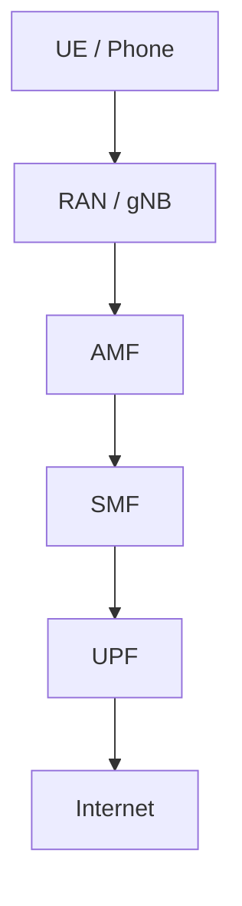

---

### Q3. What is the role of **AMF**?

**A:** **AMF** = **Access and Mobility Management Function**.  
It is the UE’s **first boss in the core** for **control**: registration, connection management, mobility. **It does not carry your YouTube traffic** (that’s more **UPF**).

---

### Q4. What does **SMF** do?

**A:** **SMF** = **Session Management Function**.  
Creates, changes, and releases **PDU sessions** (your **data session**), talks to **UPF** to set **how** traffic flows.

---

### Q5. What is **control plane** vs **user plane** separation?

**A:**

| **Control plane** | **User plane** |
|-------------------|----------------|
| **Signaling** (setup, rules, mobility) | **Real user data** (videos, web pages) |
| AMF, SMF (mostly) | **UPF** (mainly) |

**Why separate:** Scale and upgrade **data forwarding** without breaking **signaling**, and vice versa. (**CUPS** idea — see Lab 3.)

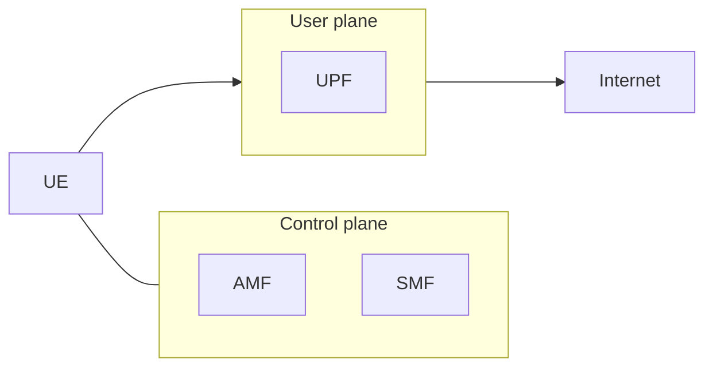

---

### Q6. How does a **UE** connect to **free5GC**?

**A (simple steps):**  
1. UE talks to **RAN** (real tower or simulator).  
2. RAN connects to **AMF** → **registration**.  
3. **Authentication** with home subscriber data.  
4. **SMF + UPF** set up **PDU session** → UE gets connectivity (e.g. internet).

---

### Q7. How would free5GC help in **network slicing**?

**A:** **Slicing** = different **virtual networks** on same hardware. free5GC lets you define **different sessions/policies** (different DNN/SST or configs) so **gaming** traffic can get **low delay** settings and **IoT** another **cheap/slow** profile — same core, **different “slice behavior.”**

---

### Q8. If latency is high, which component will you analyze **first** and why?

**A:** Often start with **RAN + UPF path** (user plane), because **latency** is felt on the **data path**. But you also check **SMF/UPF** rules and **where UPF is placed** (far UPF = more delay). For viva: “**Check user-plane path first**, then **SMF/UPF placement**, then transport.”

---

### Q9. What is **network slicing**?

**A:** One physical 5G network, several **logical slices** — each with different **speed, delay, reliability** for different services (e.g. **factory** vs **mobile broadband**).

---

### Q10. What is **QoS** in 5G?

**A:** **QoS** = **Quality of Service** = **network guarantees/rules**: priority, bandwidth limits, delay targets. The network tries to **meet** these rules for each flow/slice.

---

### Q11. What are the **limitations** of free5GC?

**A:** Not a full commercial operator core; **scale** limited; some **features** incomplete vs real telco; needs **correct config**; performance depends on **your PC**. Good for **lab/learning**, not “replace Jio/Airtel core” without huge work.

---

### Q12. What are **use cases** of free5GC?

**A:** **Education**, **research**, **testing new apps**, **private 5G lab**, **prototyping slices**, learning **AMF/SMF/UPF** behavior.

---

### Q13. User complains about **high latency** — which component first?

**A:** Same idea as Q8: first suspect **path to UPF** and **UPF location**, radio conditions, and **session routing**. Mention **UPF** because **user traffic** goes through it.

---

### Q14. **UE connected** but **no internet** — what could be wrong?

**A:** Common viva answers:  
- **PDU session** not really up (SMF/UPF issue)  
- Wrong **DNN/APN** or **DNS**  
- **UPF** not routing to internet / no default route  
- **Firewall/NAT** in lab  
- Subscriber **allowed services** misconfigured  

---

### Q15. Two slices: **low-latency gaming** + **IoT** — how does free5GC help?

**A:** Configure **different network slices / DNNs / QoS profiles**: gaming slice → **low latency, higher priority**; IoT slice → **small bandwidth, tolerant delay, maybe mass devices**. free5GC lets you **practice** those **different session policies** in software.

---

# Lab 3: Open5GS + UERANSIM

### Q1. What is **Open5GS**? Purpose?

**A:** **Open5GS** is another **open-source 5G Core** implementation. **Purpose:** run a **realistic 5GC** on a PC for **testing**, **learning**, and connecting **simulators** like **UERANSIM**.

---

### Q2. What is **UERANSIM**?

**A:** Tool that **simulates** **5G UE** and **gNB** (radio side) so you can **attach** to a core **without real hardware**.

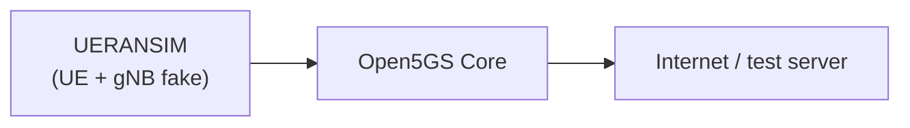

---

### Q3. Name **core network functions** in Open5GS.

**A:** **AMF, SMF, UPF, AUSF, UDM, PCF, NRF, NSSF, BSF, UDR** (you may not run all in every lab; **AMF/SMF/UPF** are the “big three” for basics).

---

### Q4. Key **interfaces** in UERANSIM (viva style)?

**A:** Think **links to core**: **N2** (RAN ↔ AMF, control), **N3** (RAN ↔ UPF, user data). UERANSIM **config YAML** points to **AMF** / **UPF** addresses — that’s what examiners want: “it speaks **NGAP/NAS** toward AMF and sets up **GTP-U** toward UPF.”

---

### Q5. What is a **subscriber database**?

**A:** Stored info for each SIM/subscriber: **SUPI**, keys (**K**, **OPc**), allowed slices, **DNN**, etc. Open5GS often uses **MongoDB** to hold such data (via web UI or files — depends on setup).

---

### Q6. **Open5GS** vs **free5GC**?

**A:** Both are **open 5GC stacks**. Different **code**, **config**, **UI**. Same **3GPP ideas**, different projects. For viva: “**Same goal, different implementation.**”

---

### Q7. Role of **MongoDB**?

**A:** **Database** where subscriber/state info may be stored. Core NFs **read/write** subscriber data; Mongo is a common **backend** in these labs.

---

### Q8. How does **authentication** work (simple)?

**A:** UE proves it has the **real SIM credentials**; core checks with **AUSF/UDM** using **5G AKA** (challenge–response). If match → **trusted UE**.

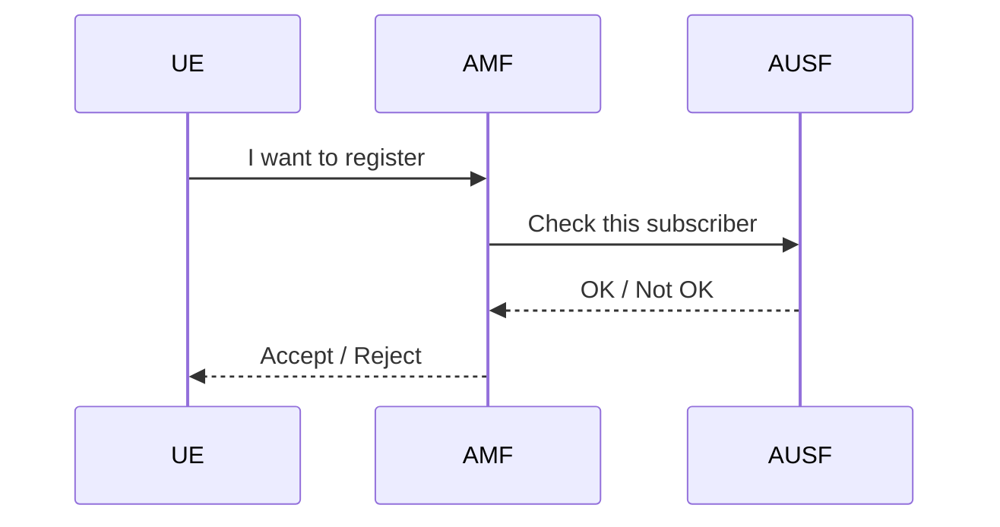

---

### Q9. **AMF** and responsibilities?

**A:** Already in Lab 2: **registration**, **connection management**, **mobility**, NAS signaling to UE — **control plane** friend of the UE.

---

### Q10. What is **NRF**?

**A:** **Network Repository Function** = **catalog/registry**. Other NFs **register** their services; NFs **discover** who to call (service-based style).

---

### Q11. What is **CUPS**?

**A:** **Control and User Plane Separation** — **SMF** (control) separated from **UPF** (user data). Lets operators **scale UPF** near users for **lower latency**.

---

# Lab 4: NS-3 & FlexRIC

### Q1. What is **NS-3**? Key features? Why used in 5G research?

**A:** **NS-3** = **Network Simulator 3** (C++/Python).  
**Features:** packet-level events, wired/wireless models, queues, protocols.  
**Why:** Cheap to try **new ideas** (scheduling, routing, AI policies) **without real towers**.

---

### Q2. NS-3 architecture — role of **Nodes, NetDevices, Channels, Applications, Protocol stack**?

**A:**

| Piece | Simple role |
|-------|-------------|
| **Node** | A “device” (phone, router, server) in simulation |
| **NetDevice** | NIC-like object connecting node to a channel |
| **Channel** | The **wire/link** medium (wifi, p2p, etc.) |
| **Applications** | Programs that **send/receive** data (traffic generators) |
| **Protocol stack** | TCP/IP / MAC / PHY layers stacked on the node |

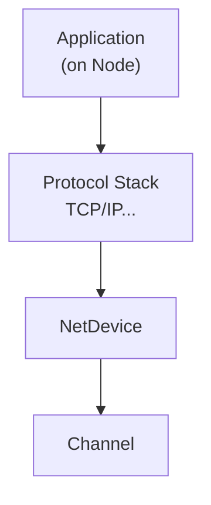

---

### Q3. How NS-3 simulates **5G**? Basic steps? **AI (RL)** integration?

**A:** **Steps (concept):** define **nodes** → install **5G/LTE or custom MAC/PHY modules** (or use **ns3-mmwave** style extensions in research) → set **mobility** → install **applications** → set **TCP/UDP flows** → **run** → collect **traces/metrics**.  
**AI/RL:** treat NS-3 as **environment**: read metrics (delay, throughput) → **RL agent** chooses action (scheduler params) → NS-3 runs next step — **loop** (often via **ns3-gym** style bridges in advanced projects).

---

### Q4. What is **FlexRIC**? Purpose in **O-RAN**?

**A:** **FlexRIC** = research platform for **O-RAN RIC** ideas. **Purpose:** run **xApps** that **observe** RAN and **send control** using **E2**-like interfaces — **smarter, programmable radio**.

---

### Q5. Role of **Near-RT RIC**? How FlexRIC supports it?

**A:** **Near-RT RIC** = **almost real-time** brain for RAN (10ms–1s style control loop). It runs **xApps** for optimization. **FlexRIC** gives software pieces to **experiment** with that control loop in **research labs**.

---

### Q6. Key FlexRIC components: **RIC platform, xApps, E2 interface, E2 nodes**?

**A:**

| Term | Simple meaning |
|------|----------------|
| **RIC platform** | Framework hosting xApps, APIs, timing |
| **xApp** | Small “app” that does **one smart job** (load balance, handover help) |
| **E2 interface** | **Connection** between RIC and RAN nodes |
| **E2 node** | RAN side that **exposes** RAN info and accepts **control** |

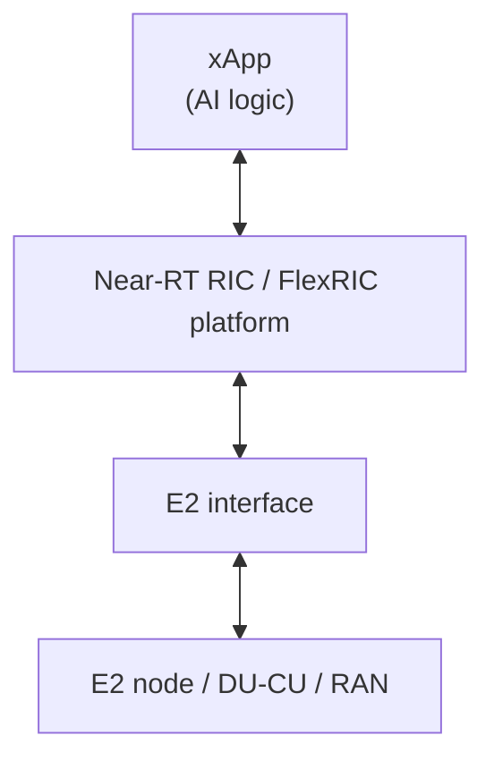

---

### Q7. **E2 interface** — what data is exchanged?

**A:** **RIC → RAN:** control actions (policy, parameters). **RAN → RIC:** **KPIs / measurements** (BLER, PRB usage, RSRP, etc.). Exact details are **standardization-heavy**; viva: **“measurements up, control down.”**

---

### Q8. **AI/ML in FlexRIC**? Advantages of **AI-driven xApps**?

**A:** Train models on **live KPIs** to predict congestion, optimize **handover**, allocate **PRBs**. **Advantage:** adapts to **real traffic** better than fixed rules.

---

### Q9. Design an **xApp for load balancing** — inputs and outputs?

**A:**  
**Inputs (metrics):** cell load, **PRB** usage per cell, **UE throughput**, **RSRP/RSRQ**, handover history, packet delay.  
**Outputs (actions):** **handover** decision, **cell reselection** hints, **scheduler weight** changes, **admit/block** new UEs in overloaded cell.

---

### Q10. Use case: FlexRIC improves **handover** or **load balancing**?

**A:** **Handover:** xApp sees weak signal before drop → triggers **smoother** handover.  
**Load balancing:** xApp sees one cell **too hot** → moves some UEs to neighbor cell.

---

### Q11. Advantages for **slicing** and **resource management**?

**A:** Per-slice **KPI targets** can drive **xApp** decisions; **RAN resources** (PRBs) adjusted **dynamically** per slice needs — **more automation**, **better use** of spectrum.

---

# Lab 5: Multi-Agent AI for 5G QoE analysis

### Q1. **QoE** vs **QoS**?

**A:**

| **QoS** | **QoE** |
|---------|---------|
| Network **technical** quality (delay, jitter, loss rules) | User **felt** quality (“video was smooth / annoying”) |
| “What the network promises” | “What human experiences” |

---

### Q2. What are **KPIs** in 5G?

**A:** **Key Performance Indicators** — numbers to measure network: **throughput**, **latency**, **packet loss**, **jitter**, **BLER**, **availability**, etc.

---

### Q3. What is **latency** and **packet loss**?

**A:**  
- **Latency** = **time delay** for a packet to go from A to B (ms).  
- **Packet loss** = **percentage of packets** that never arrive (bad WiFi/congestion).

---

### Q4. What is an **AI agent**?

**A:** A **small AI worker** with a **job** (check KPIs, classify QoE, give advice). Many agents together = **multi-agent system**.

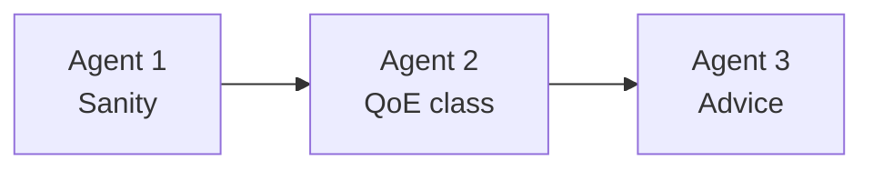

---

### Q5. What is **LangChain**?

**A:** **Python framework** to build LLM apps: **prompts**, **tools**, **chains** of steps, memory helpers.

---

### Q6. What is **LangGraph**?

**A:** Builds LLM workflows as a **graph** (nodes + edges): **branches**, **loops**, **human approval** steps — better for **multi-agent** flows than one straight line.

---

### Q7. What is an **LLM**?

**A:** **Large Language Model** — AI that predicts text; answers questions, reasons about KPI/QoE if you give good prompts and data.

---

# Lab 6: Spring Boot & Swagger (also in PDF)

### Q1. What is **Spring Boot**?

**A:** **Java framework** to make **web servers + APIs** quickly with less boilerplate (auto-config, embedded server).

---

### Q2. What is **API-First** development?

**A:** Design the **API contract first** (URLs, request/response shapes), then **write code** to match it. Teams agree early; fewer surprises.

---

### Q3. What is **Maven**?

**A:** **Build tool** for Java: downloads **dependencies**, compiles, packages **JAR/WAR**.

---

### Q4. Why define **API before coding**?

**A:** Clear agreement between **frontend**, **backend**, **testers**; fewer redesigns; can generate **docs/clients** early.

---

### Q5. Role of **Swagger UI**?

**A:** **Interactive webpage** to **see** and **try** REST APIs (Try it out → see response) — great for **testing** and **demos**.

---

### Q6. What happens in a **POST** request?

**A:** Client sends **body data** to server; server often **creates** a resource or **triggers** an action; returns **status + response** (e.g. 201 Created).

---

### Q7. **API-first** vs **code-first**?

**A:** **API-first** = contract first. **Code-first** = write code, API emerges from code (faster start but messier for teams).

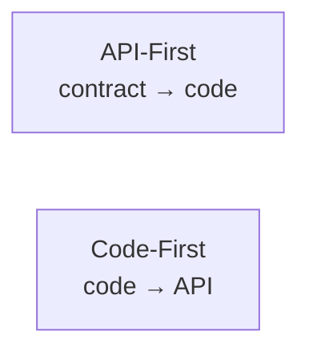

---

# Lab 7: MEC + LLM (also in PDF)

### Q1. What is **MEC**?

**A:** **Multi-access Edge Computing** — run apps **close to users** (edge of network), not only in far **cloud**. **Less delay**.

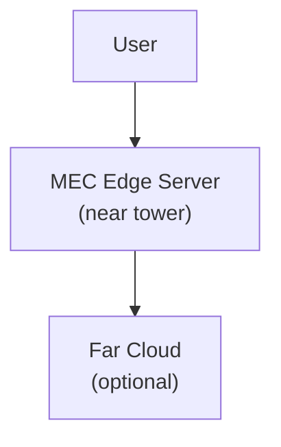

---

### Q2. What does **DNS collector script** do?

**A:** Reads **DNS queries/responses** to know **which domains** users look up — **lightweight** view of **traffic intent**.

---

### Q3. Why **MEC** preferred over **cloud** for some apps?

**A:** **Lower latency**, **local processing**, **less backhaul**, good for **AR/VR**, **gaming**, **factory control**.

---

### Q4. What is **real-time network analysis**?

**A:** Watching network behavior **now** (live metrics/alerts), not only yesterday’s report.

---

### Q5. What is **IP-wise traffic analysis**?

**A:** Measuring **how much traffic** each **IP** sends/receives (who is heavy user).

---

### Q6. **Bandwidth high** but **domains unknown** — what happens?

**A:** You see **big bytes** but not **which apps/sites** — hard to **optimize** or **charge** fairly; that’s why **DNS** or **DPI** (deeper inspection) helps (privacy rules apply).

---

### Q7. Why capture only **DNS**, not full packets?

**A:** **DNS is tiny** compared to all packets → **less storage**, **less privacy risk**, **less CPU** — still gives **domain names**.

---

# Lab 8: Ella Core & Federated Learning (also in PDF)

### FL Q1. **Federated Learning** vs centralized ML?

**A:** **Centralized:** all raw data sent to one server to train. **Federated:** each device trains **locally**, sends only **small updates** (weights), server **combines** — raw data stays on device.

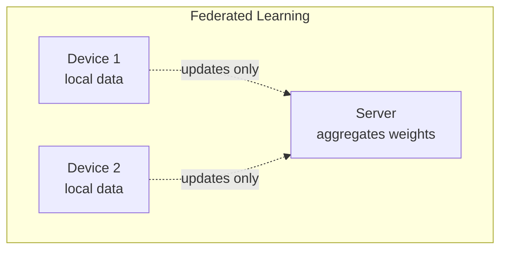

---

### FL Q2. **Architecture** — clients, aggregator, rounds?

**A:** **Clients** train on local data → send **gradients/weights** → **central server aggregates** (average) → sends **global model** back → **repeat** for many **rounds** until good accuracy.

---

### FL Q3. **Privacy** in FL?

**A:** **Raw data not uploaded**; only **model updates** shared. Still some **privacy risk** from updates (research area) — techniques: **secure aggregation**, **DP noise**, encryption.

---

### FL Q4. Challenges: **communication overhead**, **non-IID**, **heterogeneity**?

**A:**  
- **Communication:** many devices sending weights = slow/expensive.  
- **Non-IID:** each phone’s data is **different pattern** → harder training.  
- **Heterogeneity:** different **CPU/battery/network** — some devices slow or drop.

---

### FL Q5. **5G smart city** — one training round workflow + device variability issues?

**A:** **Round:** server sends model → each car/sensor **trains locally** one step → sends update → server **averages** → new global model.  
**Variability:** weak phones **drop out**, **biased** data from only some roads, **slow** 5G links delay rounds.

---

### FL Q6. Operator FL for **behavior prediction** without raw data — privacy + extra security?

**A:** **Privacy:** FL avoids raw logs centrally. **Extra:** secure aggregation, differential privacy, TLS, attestation, anomaly detection on updates.

---

### FL Q7. Why FL better than centralized cloud for **5G** (two benefits)?

**A:** (1) **Less backhaul** — data stays near user. (2) **Privacy/compliance** — sensitive mobility patterns not centralized.

---

### FL Q8. **Ella Core** concept and purpose?

**A:** **Ella Core** = **lab-friendly 5G core simulation** with **UI** to learn **subscriber, attach, sessions** without fighting a full telco-grade install. **Purpose:** **teach and demo** 5G core flows.

---

### FL Q9. **Ella Core**, **UERANSIM**, **Docker network** roles?

**A:**  
- **Ella Core:** runs **5GC** pieces + dashboard.  
- **UERANSIM:** **fake UE / gNB** traffic into core.  
- **Docker network:** private **virtual LAN** so containers **see each other** by name/IP cleanly.

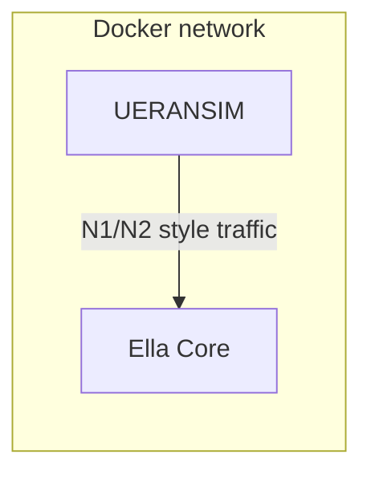

---

### FL Q10. Why Ella Core over **full Open5GS** in some labs?

**A:** **Easier UI**, faster **success path** for beginners, less manual **config** — tradeoff: less “real operator depth,” more **pedagogy**.

---

## One-page “exam memory” diagram

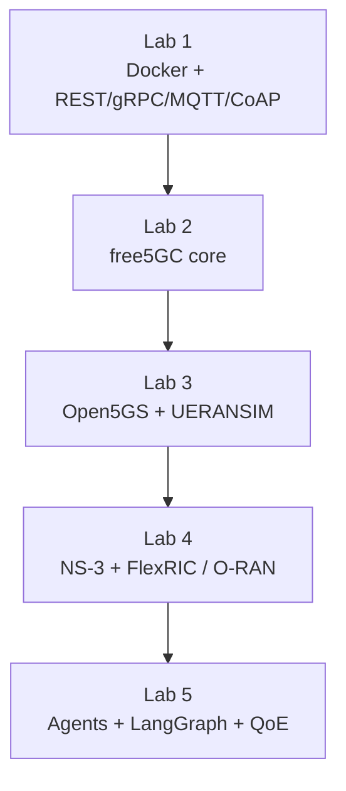

---

*If you want, tell me your teacher’s expected “one-line” answers only — I can shrink this file to a cheat sheet.*
